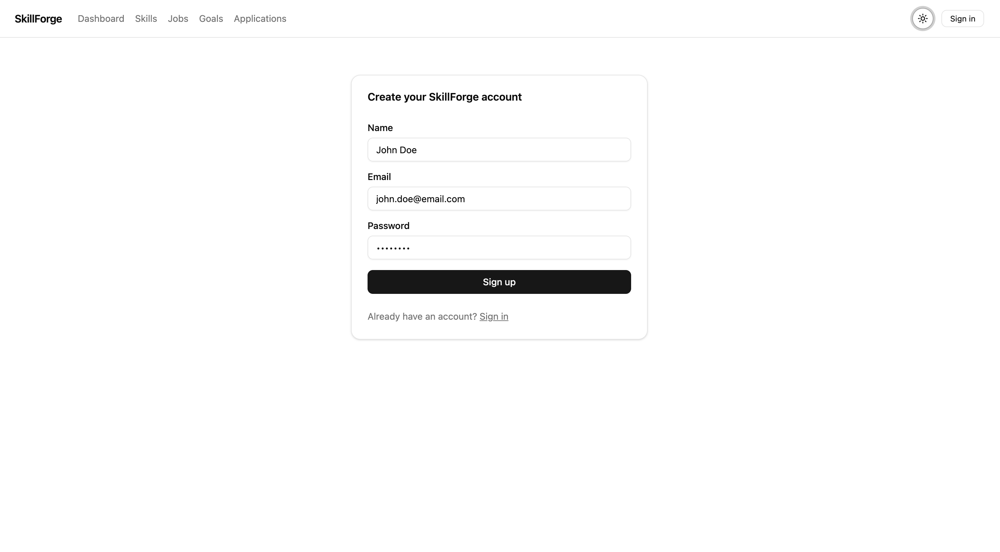
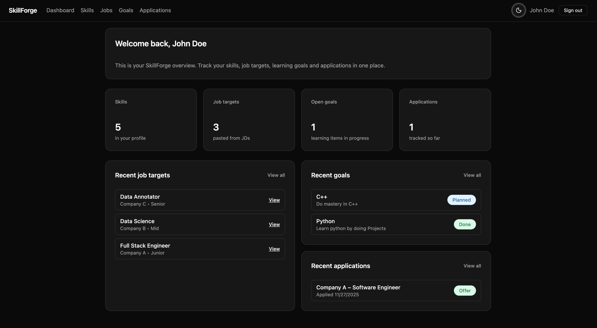
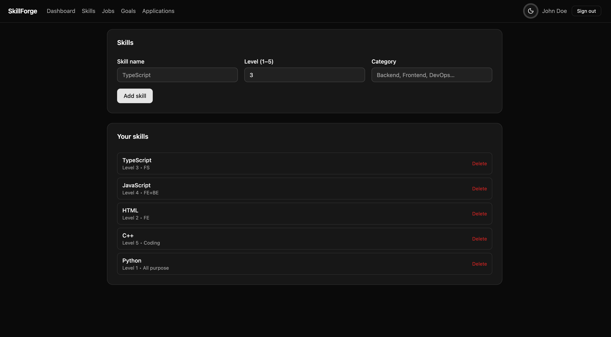
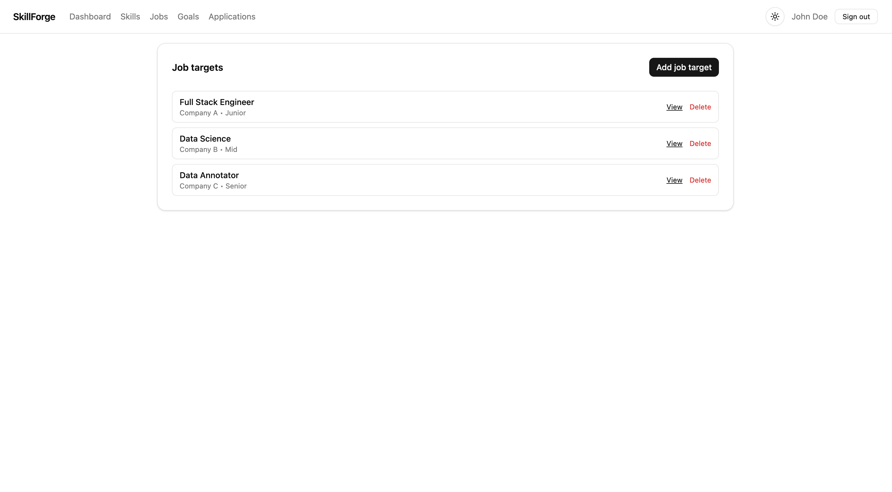
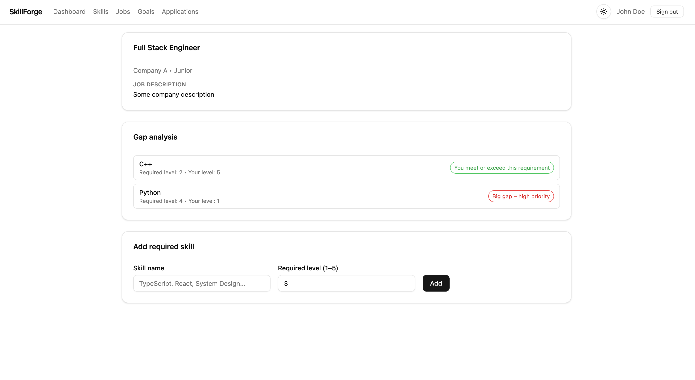
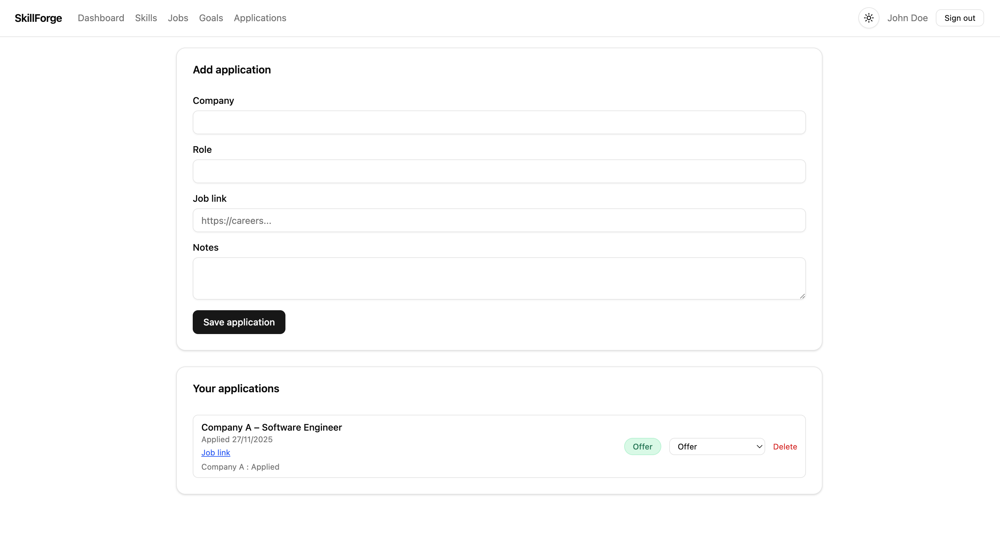

# 📘 SkillForge – Career Roadmap & Job-Fit Planner

SkillForge is a full-stack **Next.js 16** application designed to help users track skills, compare them against job descriptions, identify gaps, and build a personalized learning roadmap.  
It also includes job application tracking, learning goals, and a clean dashboard experience.

This project is built using a modern **2025 tech stack** to demonstrate full-stack proficiency for software engineering roles.

---

# 🚀 Tech Stack

### **Frontend / Full Stack**
- ⚛️ **Next.js 16** (App Router, React Server Components)
- 🧠 **React** + **TypeScript**
- 🎨 **Tailwind CSS** (with dark mode)
- 🧩 **shadcn/ui** components
- 🌗 **next-themes** (light/dark theme toggle)

### **Backend**
- 🟦 **Next.js Route Handlers** (`app/api/*`)
- 🧾 **Zod** for schema validation
- 🔐 **Auth.js (NextAuth)** with Credentials provider
- 🔑 Secure DB-backed sessions

### **Database**
- 🐘 **PostgreSQL**
- 📦 **Prisma ORM**
- 🛠️ Full CRUD on skills, jobs, goals, applications

### **Developer Tools**
- Prisma Studio  
- ESLint  
- Vercel-ready deployment  

---

# 🌟 Features

### 👤 User Authentication
- Email + password sign-up and sign-in  
- Secure Credentials authentication  
- Database session strategy  
- Protected routes (`/dashboard`, `/skills`, `/jobs`, etc.)

### 📊 Dashboard
- Overview of skills, jobs, learning goals, applications  
- Recent activity snapshot  
- Color-coded status indicators  
- Dark/light mode compatible

### 🧠 Skills Management
- Add skills with levels (1–5)
- Categorize skills
- Update + delete

### 💼 Job Targets
- Add job descriptions with role/company/seniority
- View them in a clean list
- Delete job targets
- Access detailed view

### ⚔️ Gap Analysis (Job Detail Page)
- Compare required skills with user skills  
- See mismatches visually  
- Create related learning goals  

### 🎯 Learning Goals
- Create goals with title + description  
- Status flow: Planned → In Progress → Done  
- Color-coded and editable  
- Full delete support

### 📝 Job Applications
- Track application status  
- Status flow: Applied → OA → Interview → Offer → Rejected  
- Update and delete apps inline  
- Optional job link + notes

### 🌓 Dark Mode
- Sun/Moon toggle  
- Global theming  
- All components theme-aware  

---

# 📸 Screenshots

### 🔐 Sign In Page


### 🏠 Dashboard


### 🧠 Skills Page


### 💼 Job Targets


### ⚔️ Gap Analysis (Job Detail)


### 🎯 Learning Goals


### 📝 Job Applications


---

# 📂 Project Structure

```
src/
  app/
    auth/
      sign-in/
      sign-up/
    dashboard/
    skills/
    jobs/
      [id]/
      new/
    goals/
    applications/
  components/
    ui/           # shadcn/ui components
    theme-toggle/
    theme-provider/
  lib/
    auth.ts
```

---

# 🛠️ Environment Variables

Create `.env`:

```
DATABASE_URL="postgresql://<user>:<password>@localhost:5432/skillforge?schema=public"
NEXTAUTH_SECRET="<long-random-hex>"
NEXTAUTH_URL="http://localhost:3000"
```

---

# 🧰 Local Development

### 1. Install Dependencies
```bash
npm install
```

### 2. Run Prisma Migrations
```bash
npx prisma migrate dev
```

### 3. Start Server
```bash
npm run dev
```

Open:  
👉 http://localhost:3000

---

# 🔑 Authentication Overview

Auth.js (NextAuth) with Credentials provider:

- `/auth/sign-up` → Register  
- `/auth/sign-in` → Login  
- `/api/auth/*` → Backend routes  
- Sessions stored in Prisma `Session` table  

Protected routes handled via:

```ts
export { auth as middleware } from "./lib/auth";
```

---

# 🗃️ Database Schema Highlights

Prisma models used:
- User  
- Skill  
- JobTarget  
- JobRequiredSkill  
- LearningGoal  
- JobApplication  
- Session (Auth.js)  

`Account` and `VerificationToken` models removed as they are not required for Credentials auth.

---

# 🧹 Scripts

| Script | Description |
|--------|-------------|
| `npm run dev` | Start development server |
| `npm run build` | Build production bundle |
| `npm run start` | Run production server |
| `npx prisma studio` | DB explorer |

<!-- ---

# 🚀 Deployment (Vercel)

1. Push repo to GitHub  
2. Import into Vercel  
3. Add environment variables  
4. Connect to hosted Postgres (Neon/Supabase)  
5. Run migrations:

```bash
npx prisma migrate deploy
```

6. Redeploy → Live 🎉 -->

---

# 🎯 What This Project Demonstrates

- Modern **full-stack architecture**
- **Database design** + relational modeling
- **Authentication** with secure sessions
- **Server Components + Client Components**
- **Clean UI** with shadcn + Tailwind
- **Type-safe APIs** with Zod
- **Dark/light theming**
- **CRUD across all features**

Perfect for showcasing professional engineering skills.
---

# ⭐ If you like this project, star the repo!
